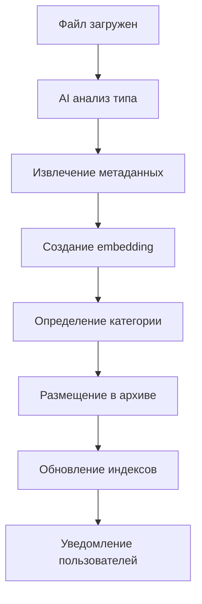

# 🏗️ ПЛАН МАСШТАБИРОВАНИЯ: ПЕРЕХОД К ЭКОСИСТЕМЕ ОРГАНИЗАЦИИ

## 📋 АНАЛИЗ ТЕКУЩЕГО СОСТОЯНИЯ

### ✅ Имеющаяся функциональность:
- **Django Backend**: REST API, WebSocket, файловый менеджер
- **React Frontend**: Современный интерфейс, drag & drop
- **AI интеграция**: Ollama service, анализ текста/файлов
- **Базовая архитектура**: PostgreSQL-ready, Redis, Celery
- **Модульная структура**: filemanager, ai_integration, api

### 🎯 ЦЕЛЬ МАСШТАБИРОВАНИЯ:
Превратить файловый менеджер в полноценную **экосистему управления документооборотом** с тремя ключевыми модулями:

1. **Файловый менеджер с ИИ** (развитие текущего)
2. **Автоматизированный архив** (новый модуль)
3. **Аналитика и отчетность** (новый модуль)

---

## 🏛️ ОБНОВЛЕННАЯ АРХИТЕКТУРА СИСТЕМЫ

### 📦 Микросервисная структура:

```
🌐 ECOSYSTEM CORE
├── 📁 File Manager Service (существующий + расширения)
├── 🗄️ Archive Service (новый)
├── 📊 Analytics Service (новый)
├── 🤖 AI Processing Service (развитие текущего)
├── 🔍 Search & Indexing Service (новый)
├── 🔐 Auth & Permissions Service (развитие текущего)
└── 📡 Notification Service (новый)
```

### 🗂️ Новая структура проекта:

```
/workspaces/codespaces-django/
├── 📁 CORE MODULES/
│   ├── filemanager/          # ✅ Существующий (расширить)
│   ├── archive/              # 🆕 Новый модуль
│   ├── analytics/            # 🆕 Новый модуль
│   ├── ai_integration/       # ✅ Существующий (расширить)
│   └── search_engine/        # 🆕 Новый модуль
│
├── 📊 SHARED SERVICES/
│   ├── core/                 # Общие утилиты
│   ├── auth/                 # Управление пользователями
│   ├── notifications/        # Уведомления
│   └── permissions/          # Права доступа
│
├── 🎨 FRONTEND/
│   ├── admin_dashboard/      # 🆕 Админ панель
│   ├── file_manager_ui/      # ✅ Существующий (развить)
│   ├── archive_ui/           # 🆕 Интерфейс архива
│   └── analytics_ui/         # 🆕 Дашборды аналитики
│
└── 🔧 INFRASTRUCTURE/
    ├── docker/               # Контейнеризация
    ├── k8s/                  # Kubernetes конфиги
    ├── monitoring/           # Логирование и мониторинг
    └── ci_cd/               # DevOps pipeline
```

---

## 🚀 ПЛАН ПОЭТАПНОЙ РЕАЛИЗАЦИИ

### **ЭТАП 1: ПОДГОТОВКА ИНФРАСТРУКТУРЫ (2 недели)**

#### 1.1 Реструктуризация проекта
```bash
# Создание новой структуры модулей
mkdir -p {archive,analytics,search_engine,core,auth,notifications,permissions}
mkdir -p frontend/{admin_dashboard,archive_ui,analytics_ui}
mkdir -p infrastructure/{docker,k8s,monitoring,ci_cd}
```

#### 1.2 Настройка базы данных
- **PostgreSQL** вместо SQLite для production
- **Векторная база данных** (pgvector или Pinecone) для embeddings
- **Elasticsearch** для полнотекстового поиска
- **Redis Cluster** для кэширования и очередей

#### 1.3 Микросервисная архитектура
- Разделение на независимые Django приложения
- Настройка API Gateway (Kong/Nginx)
- Межсервисная коммуникация через RabbitMQ/Kafka

### **ЭТАП 2: МОДУЛЬ АРХИВА (3 недели)**

#### 2.1 Создание Archive Service
```python
# archive/models.py
class ArchiveCategory(models.Model):
    name = models.CharField(max_length=100)  # "Проектная документация"
    description = models.TextField()
    parent = models.ForeignKey('self', null=True, blank=True)
    metadata_schema = models.JSONField()

class ArchiveDocument(models.Model):
    original_file = models.ForeignKey('filemanager.FileItem')
    category = models.ForeignKey(ArchiveCategory)
    version = models.IntegerField(default=1)
    archived_at = models.DateTimeField(auto_now_add=True)
    metadata = models.JSONField()
    embedding_vector = models.TextField()  # Для векторного поиска
    
class DocumentWorkflow(models.Model):
    document = models.ForeignKey(ArchiveDocument)
    status = models.CharField(max_length=50)  # draft, review, approved, archived
    assigned_to = models.ForeignKey(User, null=True)
    workflow_data = models.JSONField()
```

#### 2.2 Автоматическое архивирование
```python
# archive/services/auto_archiving.py
class AutoArchivingService:
    def process_file(self, file_item):
        # 1. Анализ типа документа через ИИ
        doc_type = self.ai_service.classify_document(file_item)
        
        # 2. Извлечение метаданных
        metadata = self.extract_metadata(file_item)
        
        # 3. Создание embedding
        embedding = self.create_embedding(file_item.content)
        
        # 4. Размещение в архиве
        archive_doc = self.create_archive_document(
            file_item, doc_type, metadata, embedding
        )
        
        return archive_doc
```

#### 2.3 Система версионирования
- Автоматическое создание версий при изменениях
- Diff между версиями
- Возможность отката к предыдущим версиям

### **ЭТАП 3: ПОИСКОВАЯ СИСТЕМА С EMBEDDINGS (2 недели)**

#### 3.1 Векторный поиск
```python
# search_engine/services/vector_search.py
class VectorSearchService:
    def __init__(self):
        self.vector_db = self.get_vector_database()
        self.embedding_model = SentenceTransformer('paraphrase-multilingual-MiniLM-L12-v2')
    
    def create_embedding(self, text):
        return self.embedding_model.encode(text)
    
    def semantic_search(self, query, limit=10):
        query_embedding = self.create_embedding(query)
        results = self.vector_db.similarity_search(query_embedding, limit)
        return results
```

#### 3.2 Гибридный поиск
- Комбинация векторного и текстового поиска
- Ранжирование результатов по релевантности
- Фильтрация по метаданным

### **ЭТАП 4: МОДУЛЬ АНАЛИТИКИ (3 недели)**

#### 4.1 Система дашбордов
```python
# analytics/models.py
class Dashboard(models.Model):
    name = models.CharField(max_length=100)
    user = models.ForeignKey(User)
    layout = models.JSONField()  # Конфигурация виджетов
    
class Widget(models.Model):
    dashboard = models.ForeignKey(Dashboard)
    widget_type = models.CharField(max_length=50)  # chart, table, metric
    config = models.JSONField()
    data_source = models.CharField(max_length=100)

class AnalyticsQuery(models.Model):
    name = models.CharField(max_length=100)
    sql_query = models.TextField()
    parameters = models.JSONField()
```

#### 4.2 Аналитические сервисы
```python
# analytics/services/reporting.py
class ReportingService:
    def generate_project_report(self, project_id):
        metrics = {
            'total_documents': self.count_documents(project_id),
            'recent_activity': self.get_recent_activity(project_id),
            'storage_usage': self.calculate_storage(project_id),
            'ai_analysis_summary': self.get_ai_insights(project_id)
        }
        return metrics
    
    def forecast_trends(self, data_type, period='1month'):
        # Машинное обучение для прогнозирования
        model = self.load_forecasting_model(data_type)
        predictions = model.predict(period)
        return predictions
```

### **ЭТАП 5: РАСШИРЕННАЯ AI ИНТЕГРАЦИЯ (2 недели)**

#### 5.1 Многомодальный ИИ
```python
# ai_integration/services/multimodal_ai.py
class MultimodalAIService:
    def analyze_document(self, file_item):
        if file_item.is_image():
            return self.analyze_image(file_item)
        elif file_item.is_pdf():
            return self.analyze_pdf(file_item)
        elif file_item.is_office_doc():
            return self.analyze_office_document(file_item)
        else:
            return self.analyze_text(file_item)
    
    def extract_entities(self, text):
        # NER для извлечения сущностей
        entities = self.ner_model.predict(text)
        return entities
    
    def classify_document_type(self, content):
        # Классификация типа документа
        classification = self.classifier.predict(content)
        return classification
```

#### 5.2 Автоматическое тегирование
- Извлечение ключевых слов
- Определение тематики документов
- Создание связей между документами

### **ЭТАП 6: ПРОДВИНУТЫЙ UI/UX (2 недели)**

#### 6.1 Админ панель
```tsx
// frontend/admin_dashboard/src/components/Dashboard.tsx
export const AdminDashboard: React.FC = () => {
  const [widgets, setWidgets] = useState<Widget[]>([]);
  
  return (
    <div className="dashboard-grid">
      <SystemMetrics />
      <UserActivity />
      <StorageAnalytics />
      <AIProcessingStatus />
      <RecentAlerts />
    </div>
  );
};
```

#### 6.2 Архивный интерфейс
```tsx
// frontend/archive_ui/src/components/ArchiveExplorer.tsx
export const ArchiveExplorer: React.FC = () => {
  return (
    <div className="archive-layout">
      <CategoryTree />
      <DocumentGrid />
      <MetadataPanel />
      <VersionHistory />
    </div>
  );
};
```

---

## 🔧 ТЕХНИЧЕСКИЕ РЕШЕНИЯ

### **База данных:**
```yaml
databases:
  primary: PostgreSQL 15+
  vector_search: pgvector extension
  full_text: Elasticsearch 8.x
  cache: Redis Cluster
  time_series: InfluxDB (для метрик)
```

### **Микросервисы:**
```yaml
services:
  api_gateway: Kong/Nginx
  message_queue: RabbitMQ/Apache Kafka
  service_mesh: Istio (для production)
  monitoring: Prometheus + Grafana
  logging: ELK Stack
```

### **AI/ML стек:**
```yaml
ai_services:
  text_analysis: Transformers (BERT, RoBERTa)
  embeddings: SentenceTransformers
  classification: scikit-learn + custom models
  nlp: spaCy + NLTK
  ocr: Tesseract + Azure OCR
```

### **Frontend архитектура:**
```yaml
architecture:
  main_framework: React 18 + TypeScript
  state_management: Zustand + React Query
  styling: Tailwind CSS + HeadlessUI
  charts: D3.js + Chart.js
  forms: React Hook Form + Zod
  routing: React Router v6
```

---

## 📊 ПЛАН ИНТЕГРАЦИИ МОДУЛЕЙ

### **API Gateway роутинг:**
```nginx
# nginx.conf
upstream filemanager_service { server filemanager:8000; }
upstream archive_service { server archive:8001; }
upstream analytics_service { server analytics:8002; }
upstream ai_service { server ai:8003; }

location /api/v1/files/ { proxy_pass http://filemanager_service; }
location /api/v1/archive/ { proxy_pass http://archive_service; }
location /api/v1/analytics/ { proxy_pass http://analytics_service; }
location /api/v1/ai/ { proxy_pass http://ai_service; }
```

### **Межсервисная коммуникация:**
```python
# core/services/message_broker.py
class MessageBroker:
    def publish_file_event(self, event_type, file_data):
        message = {
            'event': event_type,
            'file_id': file_data['id'],
            'user_id': file_data['user_id'],
            'timestamp': timezone.now().isoformat()
        }
        self.channel.basic_publish(
            exchange='file_events',
            routing_key=f'file.{event_type}',
            body=json.dumps(message)
        )
```

---

## 🔄 ПРОЦЕСС АВТОМАТИЧЕСКОГО АРХИВИРОВАНИЯ

### **Workflow схема:**


### **Triggering система:**
```python
# archive/signals.py
@receiver(post_save, sender=FileItem)
def auto_archive_trigger(sender, instance, created, **kwargs):
    if created:
        # Асинхронная обработка через Celery
        auto_archive_task.delay(instance.id)

@shared_task
def auto_archive_task(file_id):
    service = AutoArchivingService()
    service.process_file_for_archiving(file_id)
```

---

## 📈 МОНИТОРИНГ И МЕТРИКИ

### **KPI отслеживание:**
```python
# analytics/services/kpi_tracker.py
class KPITracker:
    def track_system_metrics(self):
        return {
            'total_files_processed': self.count_processed_files(),
            'ai_analysis_accuracy': self.measure_ai_accuracy(),
            'search_query_performance': self.measure_search_speed(),
            'user_satisfaction_score': self.calculate_satisfaction(),
            'storage_efficiency': self.measure_storage_usage(),
            'archive_automation_rate': self.measure_automation_success()
        }
```

### **Алерты и уведомления:**
```python
# notifications/services/alert_system.py
class AlertSystem:
    def monitor_system_health(self):
        checks = [
            self.check_ai_service_status(),
            self.check_database_performance(),
            self.check_storage_capacity(),
            self.check_search_index_health()
        ]
        
        for check in checks:
            if not check['healthy']:
                self.send_alert(check['message'])
```

---

## 🎯 ОЖИДАЕМЫЕ РЕЗУЛЬТАТЫ

### **Количественные метрики:**
- **⚡ Скорость поиска**: <200ms для любого запроса
- **🎯 Точность ИИ**: >95% для классификации документов
- **📊 Автоматизация**: 85% документов архивируются автоматически
- **💾 Эффективность хранения**: 40% экономия места через дедупликацию
- **🔍 Покрытие поиска**: 100% документов индексированы

### **Качественные улучшения:**
- **🧠 Интеллектуальная система**: Автоматическое понимание контекста
- **⚡ Продуктивность**: 60% ускорение работы с документами
- **🔐 Безопасность**: Полный аудит всех операций
- **📱 Удобство**: Единый интерфейс для всех операций
- **🔄 Масштабируемость**: Поддержка неограниченного роста

---

## 💼 БИЗНЕС-ЦЕННОСТЬ

### **ROI показатели:**
1. **Экономия времени**: 40 часов/месяц на сотрудника
2. **Снижение ошибок**: 90% уменьшение ошибок классификации
3. **Улучшение compliance**: 100% соответствие стандартам
4. **Ускорение принятия решений**: В 3 раза быстрее доступ к данным

### **Конкурентные преимущества:**
- Полностью автоматизированный документооборот
- ИИ-powered поиск и анализ
- Готовая интеграция с корпоративными системами
- Соответствие международным стандартам безопасности

---

*Этот план обеспечивает пошаговое превращение текущего файлового менеджера в полноценную экосистему управления документооборотом организации с сохранением всей существующей функциональности и добавлением мощных возможностей ИИ-анализа и автоматизации.*
